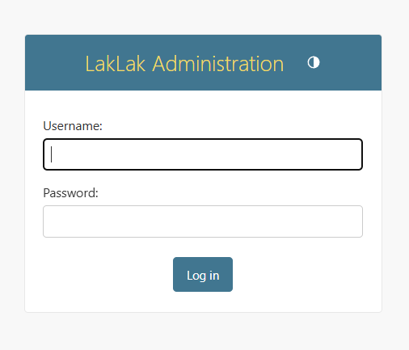
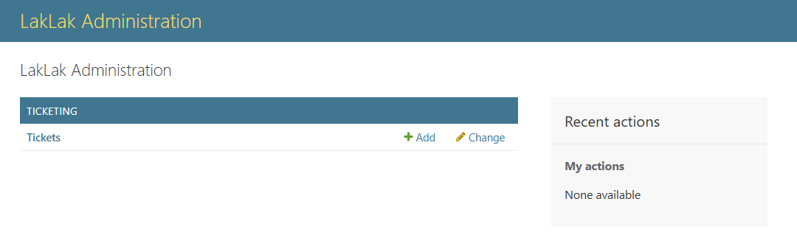
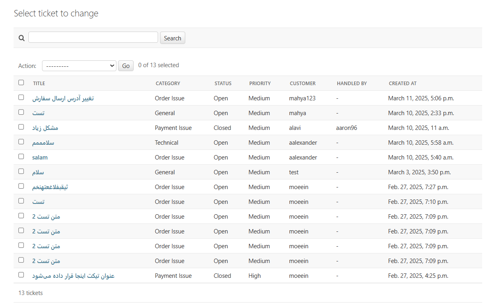
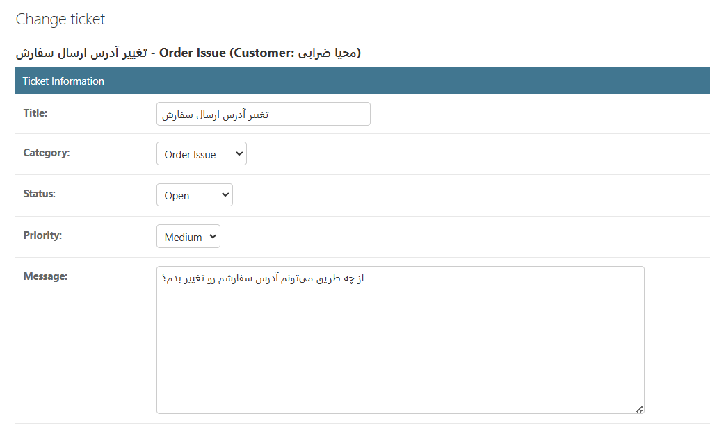
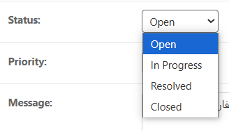
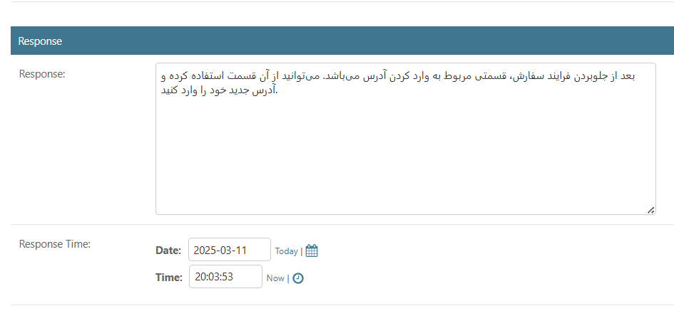
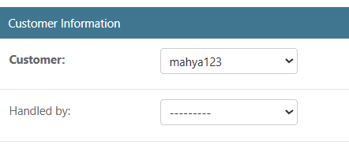
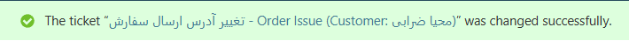

# راهنمای پاسخگویی به تیکت‌ها

## مراحل پاسخگویی

1. **ورود به پنل ادمین پشتیبانی**

   - برای ورود به بخش ادمین پشتیانی وارد لینک روبرو شوید:
     [Support Admin Panel](https://api.laklakbox.ir/admin)

2. **وارد کردن اطلاعات هویتی**

   - در صفحه مشاهده شده، نام‌کاربری و رمز خود را وارد کنید:

   

3. **ورود موفقیت‌آمیز**

   - در صورت ورود موفقیت آمیز با صفحه زیر مواجه خواهید شد:

   

4. **مشاهده تیکت‌های ثبت شده**

   - پس از کلیک بر روی tickets می‌توانید لیست تیکت‌های موجود را ببینید:

   

   - اطلاعات کلی هر تیکت در این قسمت قابل مشاهده است. برای پاسخگویی به تیکت و تغییر وضعیت تیکت روی تیکت مدنظر کلیک کنید

5. **مشاهده اطلاعات کامل هر تیکت**

   - پس از کلیک بر روی تیکت مدنظر با بخش‌های مختلفی روبرو می‌شوید که در ابتدا اطلاعات تیکت قابل مشاهده است:

   

   - در این قسمت می‌توانید وضعیت تیکت را به یکی از حالت‌های زیر تغییر دهید:

   

6. **پاسخ‌دادن به تیکت‌ها**

   - در قسمت بعدی می‌توانید پاسخ خود به تیکت را وارد کرده و در نهایت زمان مربوط به پاسخ دهی را وارد کنید

   

   - در نهایت کاربری که تیکت‌را پاسخ‌داده در قسمت مشخص تصویر زیر انتخاب کنید:

   

7. **نهایی سازی پاسخ به تیکت**

   - در نهایت بعد از کلیک بر روی دکمه save تغییرات شما ذخیره می‌شود. در ادامه به صفحه لیست تیکت‌ها هدایت می‌شوید و در صورت موفقیت، پیام زیر را مشاهده خواهبد کرد:

   

## دسته‌بندی‌های تیکت

- **مشکل در سفارش:** برای مشکلات مربوط به سفارشات خود.
- **مشکل در پرداخت:** برای مشکلات مربوط به پرداخت‌ها.
- **فنی:** برای مشکلات فنی سایت.
- **عمومی:** برای سوالات و مشکلات عمومی.
- **سایر:** برای سایر مشکلات و سوالات.

## اولویت‌های تیکت

- **کم:** برای مشکلات با اولویت کم.
- **متوسط:** برای مشکلات با اولویت متوسط.
- **زیاد:** برای مشکلات با اولویت زیاد.
- **فوری:** برای مشکلات با اولویت فوری.

## پیگیری تیکت

- **تغییر وضعیت تیکت:** وضعیت تیکت‌ها ممکن است به صورت "باز"، "در حال بررسی"، "حل شده" یا "بسته شده" تغییر کند.
- **افزودن پاسخ:** می‌توانید پاسخ‌های جدیدی به تیکت‌های خود اضافه کنید.
- **تغییر اولویت:** در صورت نیاز، می‌توانید اولویت تیکت خود را تغییر دهید.

## تماس با پشتیبانی

- **ایمیل:** support@laklakbox.ir
- **تلفن:** 123-456-7890
- **آدرس:** تهران، خیابان مثال، پلاک 123

با تشکر از استفاده شما از سیستم تیکتینگ ما!
